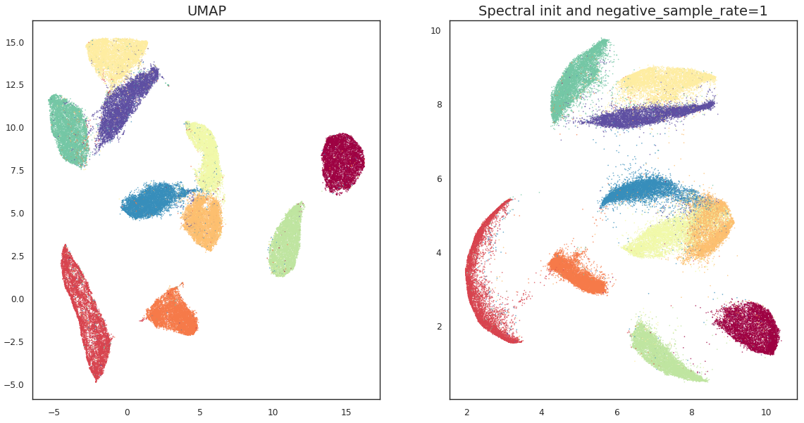

# Nano-UMAP


https://pypi.org/project/nano-umap/
```bash
pip install nano-umap
```

## How to implement UMAP like algorithm using simple tricks


Simple implementation of UMAP like algorithm in Python. It is designed to be simple 
and easy to understand. 

## References

These resources are definitely worth to read:
* 2018 - [UMAP Paper](https://arxiv.org/abs/1802.03426) - UMAP: Uniform Manifold Approximation and 
  Projection for Dimension Reduction
* 2016 - [LargeViz](https://arxiv.org/abs/1602.00370) - Visualizing Large-scale and 
  High-dimensional Data.
* 2021 - [PaCMAP Paper](https://jmlr.org/papers/v22/20-1061.html) - Understanding How Dimension 
  Reduction Tools Work: An Empirical Approach to Deciphering t-SNE, UMAP, TriMap, and PaCMAP 
  for Data Visualization
* [UMAP implementation on GPU with cuML](https://developer.nvidia.com/blog/even-faster-and-more-scalable-umap-on-the-gpu-with-rapids-cuml/)
* 2022 - [GiDR-DUN](https://arxiv.org/pdf/2206.09689) - GiDR-DUN: Gradient Dimensionality Reduction 
  Differences and Unification


## The content of this project

In the `nano_umap` folder you can find a bunch of umap_v0/v4 implementation of the UMAP
like dimensionality reduction algorithm. Each version adds some improvement to the previous
one. Some of the versions focus only on performance/speed improvements and some on the quality 
of the produced low dimensional representations.

See [demo.ipynb](notebooks/demo.ipynb) to reproduce all the results below.

## Assumptions 

All methods start from the same steps:
* Search for top-k nearest neighbors using `pynndescent` package, similarly UMAP does. See
  `core.NanoUMAPBase._get_knn` for more details, but this is basically copy of UMAP way of doing 
  this.
* Initialize low dimensional embeddings:
  * random initialization using `np.random.uniform`
  * spectral initialization using UMAP `spectral.spectral_layout` fast implementation (sklearn is way too slow)
* During optimization steps, learning rate decays linearly as `(1 - epoch / n_epochs)`
* Each method implements basically very similar `fit_transform` function:
   ```python
   def fit_transform(self, dataset: np.ndarray) -> np.ndarray:
       # use pynndescent
       knn_indices, knn_similarities = self._get_knn(dataset)        
       graph = to_adjacency_matrix(knn_indices, knn_similarities).tocoo()
        
       # use random or spectral init
       x = self._get_initial_embedding(dataset, graph)
       for epoch in range(n_epochs):
           optimize_fn(
               x,
               rows=graph.row,
               cols=graph.col,
               scores=graph.data,
               lr=self._get_lr(epoch, n_epochs),
               n_neighbors=self._n_neighbors,
               n_neg_samples=self._get_n_neg_samples(epoch, n_epochs)
           )
    
       return x
   ```
* Most of the improvements will change only the implementation of the `optimize_fn`
* All tests are run without code parallelization i.e. with `n_jobs=1`


## umap_v0.py - naive implementation

* Implements only attraction force between vectors 
* We use the same implementation for force as in UMAP code with gradient clipping

## umap_v1.py - adding repulsion forces + random initialization

* Random sampling of negative vectors which are push back sampled pairs of vectors.
* As we can see, by adding this simple method of sampling negatives the results are much better.
* However, adding negative samples increased the processing time from 20 seconds to about 40 
  seconds. UMAP needs about 20 seconds on my PC. 
* Here is what changed in the `optimize_fn` (left is new)


## umap_v1.py - adding repulsion forces + spectral initialization

* Using spectral initialization improves results even more, this already starts to look like UMAP.

## umap_v1_optimized.py - adding CPU optimizations
* Method stays the same, but the `optimize_fn` function is tuned for the CPU performance:
  * We make sure all operations are done in float32 (numba upcast all floating point variables 
    to fp64, which can introduce small performance cost)
  * We replace `np.clip` and `np.dot` with custom numba implementations (UMAP does the same)
* These tricks make code now run in about 20 seconds !
* You can see most of the changes here: 


## umap_v2.py - use inplace vector updates instead of accumulated gradients

* In previous implementations forces were accumulated before moving vectors
  * in the loops we aggregate forces like this `gradient[row][d] += grad_value`
  * at the end we update vectors: `x += gradient`
* After the update, we move vectors inplace `xi[d] += grad_value`: ![umap_v2_v1.png]
  (images/umap_v2_v1.png)  
* This small change does not increase the computational time, but it looks like it provides a 
  bit of improvement in the final result.

## umap_v3.py - negative sampling moved to the first loop

* This is a small code refactor in which we move negative sampling part inside the first loop: 
* This small change introduces more negative samples per each "edge", which increases the 
  repulsion forces in total.
* As you can see the result starts to look like UMAP.
* However, more negative samples costs more time and now it takes 40 seconds to complete.

## umap_v4.py - sample denser regions less often

* The final step is to introduce dynamic sampling based on the local neighborhood densities. 
* For simplicity, I created a heuristic which will put more attention into the regions which are 
  less densely packed
 ```python
  knn_min_scores = knn_similarities.min(-1)
  # higher weights (more samples) for regions where vectors are more separated 
  weights = 1 / knn_min_scores ** 2
 ```
* These `weights` are later converted to how often each pair is updated in the loop, using same 
  approach as in UMAP.
* This simple sampling heuristic reduces the processing time to 16 seconds.
* In UMAP this sampling is more complicated 1) `weights` are computed using different heuristics 
  and 2) there is a separate sampling mechanism for negative pairs.
